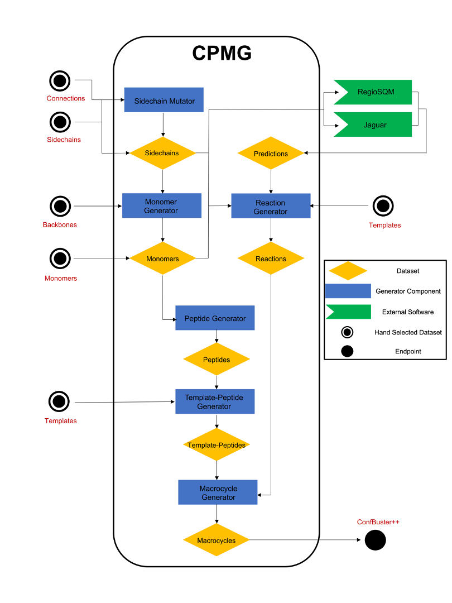

# Composite Peptide Macrocycle Generator

Publication pending.

## Description
CPMG is a program for generating giga-scale composite peptide macrocycle libraries using the cheminformatics library [RDKit](https://www.rdkit.org)<sup>1</sup> in order to mimic the chemistry developed in our lab's ([Dr. Harran](http://www.chem.ucla.edu/harran/), [Dr. Houk](https://www.chem.ucla.edu/houk/)) prior experimental work on synthesizing composite peptide macrocycles using a templated based approach, where the template is the cinnamyl cation. Using the external program [RegioSQM](https://github.com/jensengroup/RegioSQM)<sup>2</sup> and [Jaguar](https://www.schrodinger.com/jaguar)<sup>3</sup> to predict carbon and heteroatomic EAS reactivity, respectively, CPMG is able to filter out synthetically intractable compounds from being generated. This program also uses our conformational sampling tool, [ConfBuster++](https://github.com/e-dang/ConfBusterPlusPlus) (which is an RDKit port of [ConfBuster](https://github.com/patricklague/ConfBuster)<sup>4</sup>), to generate 3D structures for the resulting macrocycle library. This software was used to generate the library of 2 x 10<sup>9</sup> macrocycles described in our currently pending publication. The property and shape diversity of the macrocycle library generated by CPMG is demostrated in the distributions of the molecular weight, number of rotatable bonds, and TPSA across 10,000 randomly selected macrocycles, as well as a PMI plot of the same 10,000 macrocycles, and a randomly selected sample of 1,000,000 macrocycles, all of which are shown below.

<p align="center">
    
    
</p>
<p align="center">
    
    
</p>
<p align="center">
    
</p>

Below is a diagram of the general workflow that is used by CPMG to generate a macrocycle library. The sidechains, connections, backbones, and monomers are all datasets that can be hand selected and easily input by the user to customize the resulting macrocycle library. The template dataset can also be specified by the user, but using templates other than the default cinnamyl cation templates provided requires specific adjustments to be made to the reaction definitions in __reactions.py__.

<p align="center">
    
</p>

## Installation
Minimally, all that needs to be done is install the dependencies listed in __environment.yml__ and set the environment variable PYTHONPATH to the project root directory:
```
export PYTHONPATH=$(pwd):${PYTHONPATH}
```
This allows CPMG to be run from either the shell script in __bin__ or from __cpmg_entry_point.py__, as well as be imported into other projects.

## Usage
CPMG can be executed from the command line using a command in the following form:

```
path/to/cpmg.sh <initialize || import || export || generate || calculate || find || print || remove || deactivate> <args>
```

For example, to generate macrocycles from template_peptides of length 3 in a multi-process manner, you would execute:

```
path/to/cpmg.sh generate -p multi macrocycle -l 3
```

The full list of arguments is defined in __arg_parsers.py__.

## References
1. https://www.rdkit.org
2. Kromann, Jimmy, et al. “Fast and Accurate Prediction of the Regioselectivity of Electrophilic Aromatic Substitution Reactions.” 2017, doi:10.26434/chemrxiv.5435935.
3. https://www.schrodinger.com/jaguar
4. Barbeau, Xavier, et al. “ConfBuster: Open-Source Tools for Macrocycle Conformational Search and Analysis.” Journal of Open Research Software, vol. 6, 2018, doi:10.5334/jors.189.
5. http://openbabel.org/wiki/Main_Page
